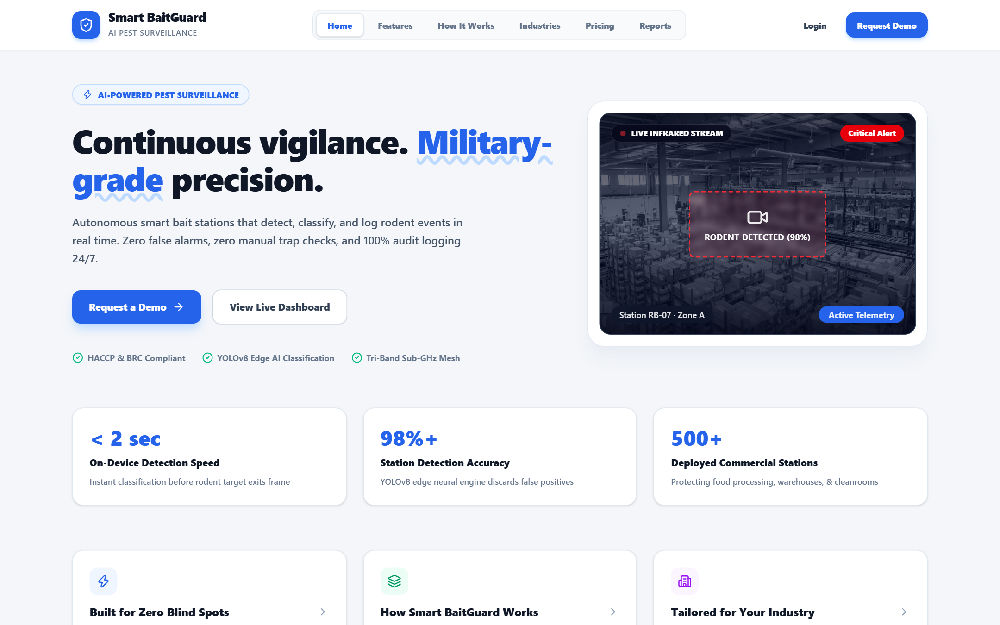
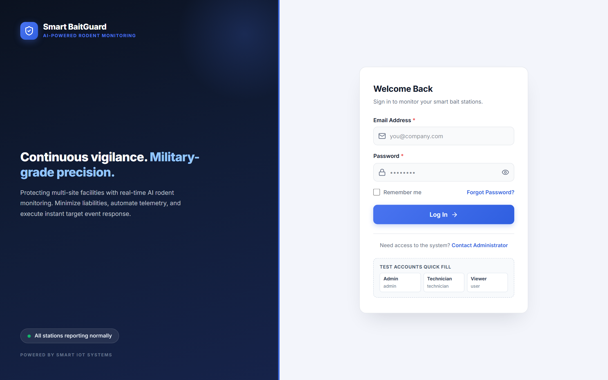
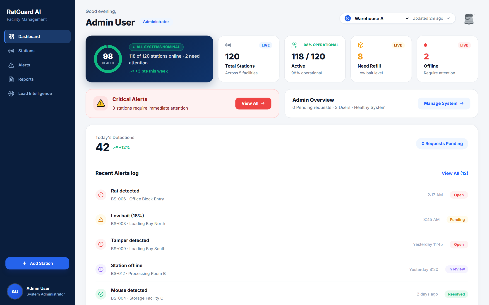
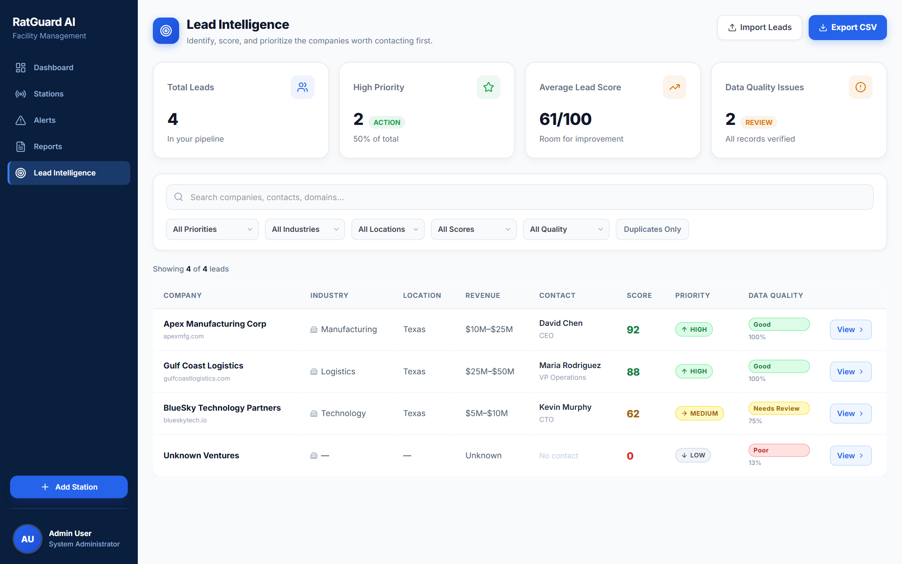
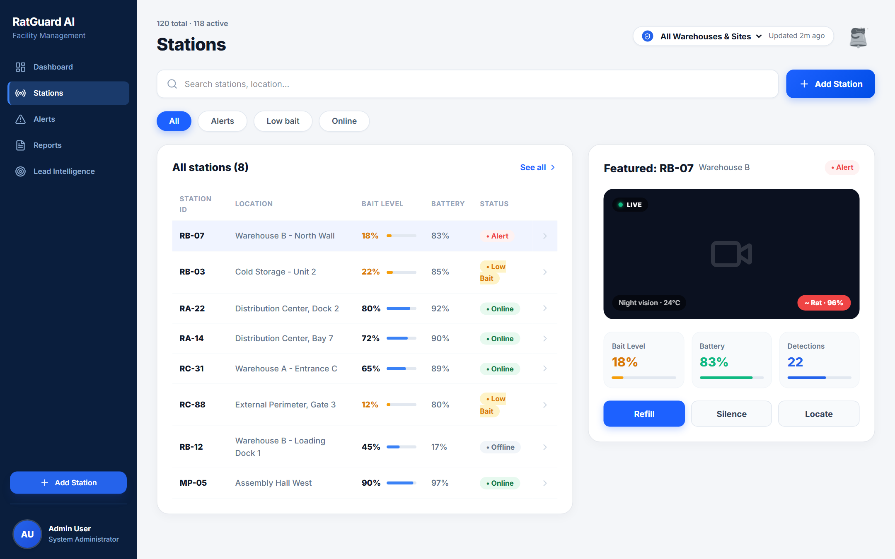
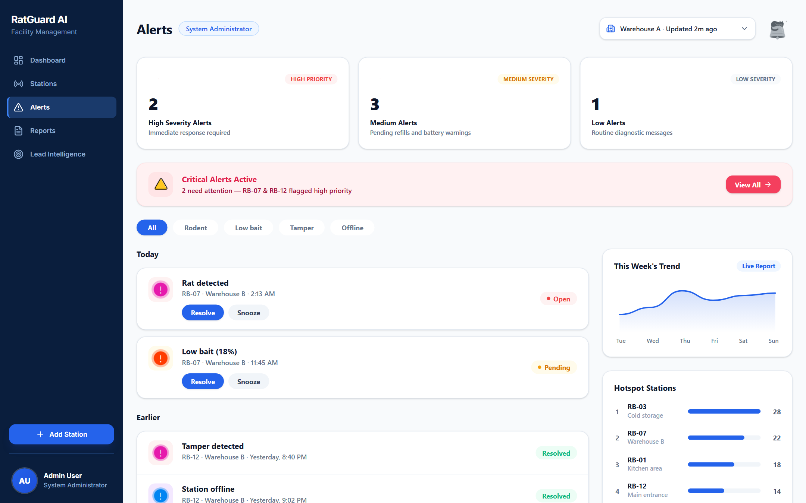

# 🐀 Bait Guard — Intelligent Rodent Monitoring & Sales Intelligence Platform

[]()
[]()
[]()
[]()
[]()
[]()
[]()
[]()

> **Bait Guard** is an enterprise-grade IoT rodent detection, facility telemetry, and AI-powered B2B sales lead intelligence platform. It bridges physical rodent monitoring stations with real-time cloud analytics, automated alert classification, role-based access control (RBAC), and an intelligent sales pipeline qualification engine.

---

## 📺 Video Demonstration

Experience a full walkthrough of the Bait Guard platform in action, covering IoT telemetry, station monitoring, RBAC governance, real-time alert dispatching, and the AI Lead Intelligence engine:

🔗 **[Watch the Video Demonstration on Google Drive](https://drive.google.com/drive/folders/1YfIOKtQEOmgz1U_ulpWOnn_H-VqigXGV?usp=sharing)**

---

## 📑 Table of Contents

- [Project Overview](#-project-overview)
- [Problem You Solved](#-problem-you-solved)
- [Key Features](#-key-features)
- [Screenshots](#-screenshots)
- [System Architecture](#-system-architecture)
- [Lead Scoring Logic](#-lead-scoring-logic)
- [AI Feature: Sales Intelligence](#-ai-feature-sales-intelligence)
- [Tech Stack](#-tech-stack)
- [Setup Instructions](#-setup-instructions)
- [Environment Variables](#-environment-variables)
- [Test Accounts](#-test-accounts)
- [API Reference](#-api-reference)

---

## 🌟 Project Overview

Commercial facilities—such as food processing plants, healthcare complexes, pharmaceutical hubs, and logistics warehouses—face stringent hygiene and regulatory requirements. Traditional rodent control involves manual trap inspections, which are slow, reactive, and lack real-time visibility.

**Bait Guard** solves this by providing:
1. **IoT Rodent Telemetry & Sensor Tracking**: Real-time telemetry monitoring bait consumption, battery life, ambient temperature/humidity, motion events, and tamper detection across multi-site facilities.
2. **Facility Governance & RBAC**: Role-based access control isolating data across facilities (`site_1` through `site_5`) with granular permissions for Administrators, Field Technicians, and Read-Only Viewers.
3. **Real-Time Alert Dispatching**: Sub-second alert broadcasting over WebSockets to notify technicians of critical rodent intrusions or low bait conditions.
4. **B2B Lead Intelligence & Qualification Engine**: An automated 8-stage sales pipeline that ingests raw business leads, cleans and validates data, eliminates duplicates, applies a 0–100 multi-factor scoring model, and leverages OpenAI GPT-4o-mini to produce actionable outreach strategies.

---

## 🎯 Problem You Solved

### 1. The Facility & Pest Management Dilemma
- **Labor-Intensive Inspections**: Field technicians spend hours manually checking empty traps across sprawling warehouses. Traps with depleted bait or dead batteries often go unnoticed for weeks.
- **Delayed Intestation Response**: Unmonitored rodent activity leads to contamination, regulatory fines, and inventory destruction before anyone is alerted.
- **Fragmented Multi-Site Oversight**: Facility managers operating multiple locations lack a centralized pane of glass to audit station health, verify technician maintenance, and track compliance.

### 2. The B2B Lead Prioritization Challenge
- **Lead Overload & Low Conversion**: Commercial pest control providers and facility service companies receive hundreds of raw leads from directories, trade lists, and inbound forms.
- **Wasted Sales Capacity**: Sales representatives spend up to 40% of their time researching unqualified leads, cold-calling companies with poor industry fit, or pursuing duplicate entries.
- **Inconsistent Outreach**: Sales teams lack standardized criteria to evaluate lead value, resulting in missed enterprise opportunities and delayed follow-ups.

### 💡 The Bait Guard Solution
- **Automated IoT Traps**: Continuous telemetry streaming eliminates routine manual inspections; technicians only visit stations that require refills, battery swaps, or immediate incident investigation.
- **Strict Role-Based Multi-Tenancy**: Technicians only access their assigned warehouses, while Administrators maintain holistic governance, user approvals, and audit logs.
- **Algorithmic Lead Prioritization**: Raw leads undergo automated normalization, duplicate identification, and 7-factor scoring (0–100) with priority categorization (`HIGH`, `MEDIUM`, `LOW`).
- **AI-Powered Outreach Intelligence**: In one click, sales reps receive executive summaries, value propositions, data hygiene warnings, and tailored pitch angles powered by OpenAI GPT-4o-mini.

---

## 🚀 Key Features

### 📡 Real-Time IoT Telemetry & Station Management
- **Live Station Monitoring**: Real-time tracking of bait levels (%), battery life (%), connectivity status (Wi-Fi/Cellular), and hardware tamper events.
- **AI Motion Detection**: On-station infrared motion sensors with AI confidence scoring to distinguish rodent intrusions from false alarms.
- **Multi-Zone Filtering**: Filter stations across facilities, zones (Zone A–D), statuses (Active, Low Bait, Alert, Offline), and search queries.
- **Interactive Facility Map**: Interactive floor plan mapping stations, zone health indicators, and active alert heatmaps.

### ⚡ Real-Time WebSocket Alerts & Incident Workflow
- **Instant Event Broadcasting**: Critical rodent triggers, low-bait thresholds (<25%), and station disconnections broadcast instantly via WebSocket connections.
- **Lifecycle Triage**: Alerts progress through status workflows: `Active` → `In-Progress` → `Resolved` with full timestamped audit logs.

### 🛡️ Role-Based Access Control (RBAC) & Multi-Tenancy
- **3-Tier Permission Hierarchy**:
  - `Admin`: Full system control, station creation/editing, user approval/role assignment, facility provisioning, and full Lead Intelligence access.
  - `Technician`: Operational management, station servicing, battery/bait refills, and alert resolution for assigned facilities.
  - `Viewer`: Read-only access to operational cards, compliance logs, and station summaries.
- **Facility Isolation**: Tenant data filtering ensures users only see stations, alerts, and metrics for their authorized facility IDs (`site_1` to `site_5`).

### 📊 Lead Intelligence & Prioritization Engine
- **8-Stage Pipeline**: `COLLECT` → `CLEAN` → `VALIDATE` → `DEDUPLICATE` → `SCORE` → `ANALYZE` → `PRIORITIZE` → `EXPORT`.
- **Multi-Factor Scoring (0–100)**: Transparent scoring evaluating Industry Fit, Revenue, Location, Company Size, Contact Completeness, Website Quality, and Data Freshness.
- **Data Quality Checklist**: Field-by-field verification calculating a 0–100% data health metric with visual status badges (`Good`, `Needs Review`, `Poor`).
- **Smart Duplicate Detection**: Normalizes domains, emails, and company names to flag potential duplicates and reference original records.
- **Batch CSV Operations**:
  - **Import**: Upload CSV files with up to 500 leads; records are automatically validated, deduplicated, and scored in real time.
  - **Export**: Generate clean, filtered CSV reports with all scores, data quality checks, and AI insights.

### 🤖 AI Sales Analysis (OpenAI GPT-4o-mini)
- **On-Demand Strategic Insights**: Deep analysis providing executive summaries, strategic value propositions, potential opportunity areas, and suggested sales outreach angles.
- **Hallucination Prevention**: Strict system guardrails instruct the model to report "Information not available" when fields are missing.
- **Deterministic Simulation Fallback**: If no OpenAI API key is provided, the backend generates an accurate, data-driven simulation based on real lead parameters.

---

## 📸 Screenshots

### 1. Landing Page & Hero
The public landing page showcasing the Bait Guard platform ecosystem, live IoT features, and interactive access request flows.


---

### 2. Authentication & RBAC Login
Secure login portal supporting Firebase Authentication, Firestore profile verification, role routing, and quick-fill test credentials.


---

### 3. Admin Governance & Real-Time Dashboard
The central command center showing facility-wide telemetry, station status distribution, recent alert feeds, and quick navigation.


---

### 4. Lead Intelligence & Prioritization Center
The comprehensive sales lead qualification table displaying lead scores (0–100), priority badges, data quality scores, duplicate indicators, and instant filtering.


---

### 5. Station Telemetry & Monitoring
Detailed view of all active rodent bait stations with live battery percentages, bait levels, connectivity indicators, and zone locations.


---

### 6. Alerts & Incident Management
Real-time incident dispatching and alert management interface for acknowledging and resolving rodent intrusions, low-bait alerts, and hardware tamper events.


---

## 🏗️ System Architecture

### Architectural Diagram

```text
┌──────────────────────────────────────────────────────────────────────────────────┐
│                             Bait Guard Architecture                              │
└──────────────────────────────────────────────────────────────────────────────────┘

                       ┌─────────────────────────────────────┐
                       │          React 19 Frontend          │
                       │   (Vite + TailwindCSS + Router v7)  │
                       └──────────────────┬──────────────────┘
                                          │
                  ┌───────────────────────┴───────────────────────┐
                  │ HTTPS REST (Bearer JWT)                       │ WSS (WebSockets)
                  ▼                                               ▼
     ┌────────────────────────┐                      ┌────────────────────────┐
     │   Express REST API     │                      │   WebSocket Server     │
     │   - /api/stations      │                      │   - Telemetry Stream   │
     │   - /api/alerts        │                      │   - Live Alert Push    │
     │   - /api/leads         │                      │   - Heartbeat Ping     │
     │   - /api/auth          │                      └────────────────────────┘
     └───────────┬────────────┘                                   │
                 │                                                │
    ┌────────────┼───────────────────────────┐                    │
    ▼            ▼                           ▼                    │
┌─────────┐ ┌──────────────┐      ┌─────────────────────┐         │
│  RBAC   │ │ Lead Scoring │      │ In-Memory DataStore │◄────────┘
│ Auth Mw │ │    Engine    │      │  (Reactive Events)  │
└─────────┘ └──────┬───────┘      └──────────┬──────────┘
                   │                         │
                   ▼                         ▼
        ┌─────────────────────┐   ┌─────────────────────┐
        │  OpenAI GPT-4o-mini │   │   Firebase Cloud    │
        │  (or Fallback Sim)  │   │  (Auth & Firestore) │
        └─────────────────────┘   └─────────────────────┘
```

### Component Breakdown

1. **Frontend Presentation Tier (React 19 + Vite)**:
   - **`AuthContext` & `NotificationContext`**: Manages user authentication state, session hydration, and real-time toast alerts.
   - **Role-Based Routing (`ProtectedRoute`)**: Guards routes based on assigned user roles (`admin`, `technician`, `viewer`).
   - **Modular UI Components**: Clean separation between reusable UI components, page views, and API communication clients.

2. **API & Real-Time Gateway Tier (Express.js + `ws`)**:
   - **REST Router (`/api`)**: Endpoints for stations, alerts, users, facilities, and sales leads.
   - **WebSocket Server (`/ws`)**: High-frequency telemetry broadcasting with 30s intervals and auto-reconnection.
   - **Security Middleware**: `helmet` security headers, CORS origin restriction, and JWT verification.

3. **Business Logic & Intelligence Tier**:
   - **`leadScoring.js`**: 7-factor scoring engine evaluating leads against centralized target criteria.
   - **`detectDuplicates()`**: Normalization and cross-matching across domains, emails, and company names.
   - **`analyzeLeadWithAI()`**: OpenAI GPT-4o-mini client producing structured JSON sales briefs.

4. **Data Persistence & Security Tier**:
   - **In-Memory DataStore**: High-performance operational singleton store with event emitters for reactive UI updates.
   - **Cloud Firestore**: User profiles (`users/{uid}`) and access requests (`accessRequests/{id}`) governed by `firestore.rules`.
   - **Firebase Authentication**: Secure user identity verification with email/password and token generation.

---

## 🎯 Lead Scoring Logic

The Bait Guard Lead Intelligence engine scores each lead on a **0–100 scale** using 7 weighted criteria defined in `SCORING_CONFIG`:

| Scoring Factor | Weight | Evaluation Criteria |
|---|:---:|---|
| **Industry Fit** | **25 pts** | **Full (25 pts)**: Manufacturing, Logistics, Food & Beverage, Healthcare, Retail.<br>**Partial (13 pts)**: Technology, Finance, Construction.<br>**None (0 pts)**: Other or missing industry. |
| **Revenue Fit** | **20 pts** | **Full (20 pts)**: $5M – $50M target revenue range.<br>**Partial (10 pts)**: Near target range ($2.5M – $5M or $50M – $75M).<br>**None (0 pts)**: Outside range or unknown revenue. |
| **Location Fit** | **15 pts** | **Full (15 pts)**: Primary target states (Texas, California, New York, Florida, Illinois).<br>**Partial (8 pts)**: Secondary states (Georgia, Ohio, Pennsylvania, Michigan).<br>**None (0 pts)**: Other locations. |
| **Company Size** | **10 pts** | **Full (10 pts)**: 50 – 500 employees.<br>**Partial (5–6 pts)**: <50 employees (5 pts) or >500 employees (6 pts).<br>**None (0 pts)**: Unknown employee count. |
| **Contact Completeness** | **10 pts** | Evaluates 5 contact fields: Contact Name, Job Title, Email, Phone, and LinkedIn.<br>Score = `(Filled Fields / 5) * 10`. |
| **Website Quality** | **10 pts** | **Full (10 pts)**: Valid URL with recognized top-level domain (TLD).<br>**Partial (5 pts)**: Incomplete or non-standard URL.<br>**None (0 pts)**: Missing website. |
| **Data Freshness** | **10 pts** | **Full (10 pts)**: Updated within ≤30 days.<br>**Recent (7 pts)**: Updated within ≤90 days.<br>**Stale (4 pts)**: Updated within ≤180 days.<br>**Outdated (1 pt)**: >180 days. |
| **Total Score** | **100 pts** | Sum of all weighted factor scores. |

### Priority Classification

```text
┌────────────────────────┬─────────────────────┬────────────────────────────────┐
│ Priority Band          │ Score Range         │ Recommended Sales Action       │
├────────────────────────┼─────────────────────┼────────────────────────────────┤
│ 🟢 HIGH PRIORITY       │ 80 – 100 points     │ Immediate outreach within 24h  │
│ 🟡 MEDIUM PRIORITY     │ 60 – 79 points      │ Enrich data & qualify further  │
│ 🔴 LOW PRIORITY        │ 0 – 59 points       │ Nurture or deprioritize        │
└────────────────────────┴─────────────────────┴────────────────────────────────┘
```

### Data Quality Checklist

Every lead is assessed across 8 essential data points:
- Company Name, Industry, Location, Revenue, Website, Contact Name, Email, Phone.
- **Percentage Formula**: `(Present Fields / 8) * 100`
- **Quality Status**:
  - `Good`: ≥ 80% completeness
  - `Needs Review`: 50% – 79% completeness
  - `Poor`: < 50% completeness

### Duplicate Detection Logic

Leads are checked for duplicates upon ingest:
1. **Domain Extraction**: Normalizes `website` and `email` domains (e.g., `https://www.apexlogistics.com` → `apexlogistics.com`).
2. **Email Normalization**: Lowercase trimmed email comparison.
3. **Company Name Sanitization**: Strips punctuation, whitespace, and case (e.g., `"Apex Logistics, Inc."` → `"apexlogisticsinc"`).
4. If a match is found, the record is flagged as `isDuplicate: true` with a pointer to `duplicateOf` and a human-readable reason (`Same company domain`, `Same email address`, or `Similar company name`).

---

## 🤖 AI Feature: Sales Intelligence

The Lead Intelligence module features an **on-demand AI analyst** powered by OpenAI's `gpt-4o-mini`.

### 1. How It Works
When an administrator clicks **"Analyze with AI"** on any lead:
1. The lead's profile (company, industry, revenue, size, contact, score breakdown, and data quality) is assembled into a structured prompt.
2. The backend dispatches a request to OpenAI's Chat Completions API with `response_format: { type: 'json_object' }`.
3. The response is parsed, stored with the lead, and returned to the frontend drawer.

### 2. Structured AI Output Schema
```json
{
  "summary": "2-3 sentence overview of the company and market position",
  "whyItMatters": "1-2 sentences detailing strategic alignment and sales value",
  "potentialOpportunity": "Specific operational efficiency or pest prevention opportunity",
  "dataConcerns": "Flagged missing data, duplicates, or completeness issues",
  "suggestedOutreach": "A tailored, high-converting outreach angle for sales reps",
  "priorityRecommendation": "High Priority | Medium Priority | Low Priority",
  "confidenceLevel": "High | Medium | Low"
}
```

### 3. Strict Guardrails & Simulation Fallback
- **No Hallucinations**: System prompts mandate: *"Do NOT invent facts. If information is unavailable in the provided data, state 'Information not available.'"*
- **Graceful Fallback**: If `OPENAI_API_KEY` is not present or the API is unreachable, the system executes an intelligent **deterministic simulation** based on the actual lead parameters, ensuring 100% feature availability during demos and offline testing.

---

## 💻 Tech Stack

### Frontend
- **Core**: [React 19](https://react.dev/), [Vite 8](https://vitejs.dev/)
- **Routing**: [React Router v7](https://reactrouter.com/)
- **Styling**: [Tailwind CSS v4](https://tailwindcss.com/)
- **Icons & Animation**: [Lucide React](https://lucide.dev/), [@lottiefiles/dotlottie-react](https://lottiefiles.com/)
- **Auth & Storage**: [Firebase SDK v12](https://firebase.google.com/) (Auth & Cloud Firestore)

### Backend
- **Server**: [Node.js](https://nodejs.org/) (ES Modules), [Express 4.21](https://expressjs.com/)
- **Real-Time**: [`ws`](https://github.com/websockets/ws) (WebSocket Server)
- **Security**: [Helmet](https://helmetjs.github.io/), [CORS](https://github.com/expressjs/cors), [jsonwebtoken (JWT)](https://github.com/auth0/node-jsonwebtoken)
- **Logging**: [Morgan](https://github.com/expressjs/morgan)
- **Data Store**: In-Memory Reactive DataStore (Singleton)

### AI & Cloud
- **LLM**: [OpenAI GPT-4o-mini](https://platform.openai.com/docs/models/gpt-4o-mini)
- **Cloud Infrastructure**: Google Firebase (Authentication & Firestore Security Rules)

### Tooling & Testing
- **Testing**: Node.js Native Test Runner (`node --test`)
- **End-to-End & Screenshots**: [Playwright](https://playwright.dev/)
- **Linting**: [Oxlint](https://oxc.rs/)

---

## 🛠️ Setup Instructions

### Prerequisites
- **Node.js**: v18.0.0 or higher
- **npm**: v9.0.0 or higher
- **Git**

### 1. Clone the Repository
```bash
git clone https://github.com/ansaftab-1/bait-guard.git
cd bait-guard
```

### 2. Backend Setup
```bash
# Navigate to backend directory
cd Backend

# Install dependencies
npm install

# Configure environment variables
cp .env.example .env

# Start development server
npm run dev
# Server running at http://localhost:5000 (WebSocket at ws://localhost:5000/ws)
```

### 3. Frontend Setup
```bash
# Navigate to frontend directory (in a new terminal)
cd Frontend

# Install dependencies
npm install

# Configure environment variables
cp .env.example .env

# Start Vite dev server
npm run dev
# Application running at http://localhost:5173
```

---

## 🔐 Environment Variables

### Backend Configuration (`Backend/.env`)

| Variable | Required | Default | Description |
|---|:---:|---|---|
| `PORT` | No | `5000` | Port for Express REST API and WebSocket server |
| `HOST` | No | `0.0.0.0` | Host interface binding |
| `CORS_ORIGIN` | No | `http://localhost:5173` | Allowed CORS origin for frontend client |
| `ENABLE_SIMULATED_TELEMETRY` | No | `true` | Enables background IoT station telemetry simulation |
| `TELEMETRY_INTERVAL_MS` | No | `30000` | Interval in milliseconds between simulated telemetry broadcasts |
| `JWT_SECRET` | No | `baitguard_super_secure...` | Secret key used to sign and verify JWT authorization tokens |
| `JWT_EXPIRY` | No | `7d` | Token validity duration |
| `OPENAI_API_KEY` | Optional | `""` | OpenAI API key for live GPT-4o-mini lead analysis. (Falls back to simulation if empty) |

### Frontend Configuration (`Frontend/.env`)

| Variable | Required | Default | Description |
|---|:---:|---|---|
| `VITE_ENABLE_REAL_BACKEND` | No | `true` | When `true`, connects to the Express REST & WebSocket backend |
| `VITE_API_BASE_URL` | No | `/api` | Base path or URL for backend REST endpoints |
| `VITE_WS_URL` | No | `ws://localhost:5000/ws` | WebSocket server connection URL |
| `VITE_FIREBASE_API_KEY` | Yes | — | Firebase Web API Key |
| `VITE_FIREBASE_AUTH_DOMAIN` | Yes | — | Firebase Auth domain |
| `VITE_FIREBASE_DATABASE_URL` | No | — | Firebase Realtime Database URL (optional) |
| `VITE_FIREBASE_PROJECT_ID` | Yes | — | Firebase Cloud Project ID |
| `VITE_FIREBASE_STORAGE_BUCKET`| No | — | Firebase Cloud Storage bucket URL |
| `VITE_FIREBASE_MESSAGING_SENDER_ID`| No | — | Firebase Cloud Messaging sender ID |
| `VITE_FIREBASE_APP_ID` | Yes | — | Firebase Web Application ID |
| `VITE_FIREBASE_MEASUREMENT_ID` | No | — | Google Analytics measurement ID |

---

## 👥 Test Accounts

For testing different roles and permissions, the following accounts are pre-seeded in the database:

| Role | Email | Password | Assigned Facilities | Permissions |
|---|---|---|---|---|
| **System Administrator** | `admin@baitguard.com` | `admin123` | All Facilities (`site_1`–`site_5`) | Full access, user management, station creation, lead intelligence |
| **Field Technician** | `technician@baitguard.com` | `tech123` | Warehouse A, Warehouse B (`site_1`, `site_2`) | Station telemetry, servicing, bait refills, alert resolution |
| **Read-Only Viewer** | `user@baitguard.com` | `user123` | Warehouse A (`site_1`) | Read-only dashboard view, telemetry inspection, reports |

---

## 📡 API Reference

All backend API routes require a valid JWT token in the `Authorization: Bearer <token>` header, except `/api/auth/login` and `/api/auth/signup`.

### Authentication Endpoints
- `POST /api/auth/login` — Authenticate user and receive signed JWT.
- `POST /api/auth/signup` — Register a new account.
- `GET /api/auth/me` — Retrieve current authenticated user profile.
- `POST /api/auth/logout` — Invalidate user session.

### IoT Station Endpoints
- `GET /api/stations` — List stations with optional `facilityId`, `status`, `zone`, and `search` filters.
- `GET /api/stations/:id` — Retrieve single station telemetry details.
- `POST /api/stations` — Provision a new station *(Admin only)*.
- `PATCH /api/stations/:id` — Update station status or trigger refills.

### Alert Endpoints
- `GET /api/alerts` — List alerts with `severity`, `facilityId`, and `status` filters.
- `GET /api/alerts/:id` — Retrieve alert event details.
- `PATCH /api/alerts/:id` — Update alert status (`active`, `in_progress`, `resolved`).

### Lead Intelligence Endpoints *(Admin Only)*
- `GET /api/leads` — Query filtered leads with KPI summaries and facet options.
- `GET /api/leads/:id` — Fetch complete lead profile and score breakdown.
- `POST /api/leads/import` — Batch import up to 500 leads via JSON payload.
- `GET /api/leads/export` — Stream filtered leads as a CSV file attachment.
- `POST /api/leads/:id/analyze` — Run on-demand OpenAI GPT-4o-mini analysis for a lead.

---

## 📄 License

This project is licensed under the **ISC License**. See the [LICENSE](LICENSE) file for details.

---

<div align="center">
  <sub>Built with care by the Bait Guard Engineering Team.</sub>
</div>
